# AI Development Framework

**AIDF** is a lightweight, AI-agnostic operating system for building software with coding agents. One shared workflow, vocabulary, document lifecycle, and set of safety boundaries — usable with Claude Code, Codex, Cursor, Gemini CLI, Aider, OpenHands, or whatever comes next.

**Version:** 5.1.1 · **Status:** usable foundation with running gates

## Process proportional to risk

Most frameworks fail because they cost the same for a typo as for a schema migration, so people route around them. AIDF runs every change on one of three tracks:

| | **Track A — Trivial** | **Track B — Standard** | **Track C — High risk** |
|---|---|---|---|
| **When** | No behavior change: docs, formatting, comments | The default: any behavior change | `database`, `security`, `mcp-write`, `infra`, `release` |
| **Documents** | **The PR. That's it.** | Spec → plan → PR → AI review → human review → release note | Track B + what the tags require |
| **Preview env** | No | Only if `ui`, `api`, or `database` | Yes |
| **Gates** | Lint, test, build + AI review + 1 approval | + PR approval against the spec | + specialist review + production approval |

A Track A change should ship in fifteen minutes with no preview infrastructure. If it doesn't, the framework is broken — not you. Full details: [guide/02-tracks.md](guide/02-tracks.md).

## Evidence, not confidence

An agent writing "tests: pass" in a Markdown table is indistinguishable from an agent fabricating it. AIDF makes the distinction mechanical:

- **Claimed evidence** — authored by an agent. Useful narrative. **Never satisfies a gate.**
- **Corroborated evidence** — emitted by a runner, carrying the commit, the exact command, the exit code, and a log URL. **The only thing a gate accepts.**

The agent's job is not to assert outcomes; it is to produce artifacts CI can corroborate. `reference/scripts/validate-evidence.sh` enforces this, and `self-test.sh` proves it rejects agent-authored evidence. See [standards/evidence.md](standards/evidence.md).

## Start here

Clone this repository, then install the framework **into** your project:

```bash
sh reference/scripts/aidf-install.sh --target /path/to/your/project
```

That vendors the framework into one directory and wires up the rest:

```text
your-project/
  .aidf/                  ← the framework: contracts, standards, templates, gates
  app/  server/  tests/   ← your code
  docs/                   ← what the framework produces: specs, plans, designs, records
  AGENTS.md  project.yaml  .github/
```

**One framework directory, not seven.** The mental model is `.aidf/` is input, `docs/` is output, everything else is yours. Upgrade later with `--upgrade`, which refreshes the vendored tree and touches nothing your project owns.

Then:

```bash
cd /path/to/your/project
sh .aidf/reference/scripts/validate-manifest.sh project.yaml   # 1. fill in commands, branches, ui/api blocks
git switch -c develop main && git push -u origin develop        # 2. create the QA integration branch
```

Read [guide/01-overview.md](guide/01-overview.md) for the mental model and [guide/02-tracks.md](guide/02-tracks.md) for the day-to-day. Protect `main` and `develop` and require Code Owner review — [reference/README.md](reference/README.md) explains why that step is the one that makes every gate real. Default branching is GitFlow (`main` + `develop` + feature/release/hotfix branches, see [standards/branching.md](standards/branching.md)); a project with no need for a persistent QA environment can opt out to trunk-based instead.

## The lifecycle

```mermaid
flowchart LR
    idea[Idea] --> track{Track?}
    track -->|A| build
    track -->|B / C| spec[Spec + classify]
    spec --> approve{Human approves}
    approve -->|No| spec
    approve -->|Yes| uitag{ui tag?}
    uitag -->|Yes| design[Design + throwaway mockup]
    uitag -->|No| plan
    design --> designapprove{Human approves both}
    designapprove -->|No| design
    designapprove -->|Yes| plan[Plan]
    plan --> planapprove{Human approves plan}
    planapprove -->|No| plan
    planapprove -->|Yes| isolate[Isolate: feat branch from develop]
    isolate --> build[Build + tests on feature branch]
    build --> verify[Verify: corroborated evidence]
    verify --> pr[Pull request to develop]
    pr --> aireview[AI review on PR]
    aireview -->|findings| fix[Build remediates]
    fix --> aireview
    aireview -->|ready for human| humanreview[Human review]
    humanreview --> merge[Merge to develop, deploy QA]
    merge --> release[Release branch -> main + documentation]
    build -.->|stop condition| halt[Stop, hand back]
```



[guide/03-workflow.md](guide/03-workflow.md) is the canonical definition; this diagram is derived from it. Branch timing and where the spec/plan land: [diagrams/lifecycle.md](diagrams/lifecycle.md). Who leads each activity (AI vs human vs CI): [diagrams/ai-human-flow.md](diagrams/ai-human-flow.md).

## Principles

- **Human-owned intent and irreversible actions.** Humans approve scope, security-sensitive changes, production releases, and merges.
- **Agents produce evidence, not confidence** — and evidence means a runner said so.
- **Plan before mutation.** Understand the repository, propose a bounded plan, then change files.
- **Stop rather than force.** Three failures on one check is a stop condition, not a reason to disable the check.
- **Small, reviewable units.** Human review capacity is the real bottleneck; agents outrun it easily.
- **Documents have owners and transitions.** A spec is not a plan; a PR is not release notes.
- **Adapters translate, they do not redefine** — and never promise a surface they don't ship.

## Repository map

| Path | Purpose | Vendored into a project? |
|---|---|---|
| `guide/` | Read first: overview, tracks, workflow, roles, documents, decisions, commands | yes |
| `standards/` | Configure once: gates, evidence, testing, UI, database, API, security, MCP, observability | yes |
| `commands/` | Eight agent prompt contracts | yes |
| `templates/` | Copy-ready documents, each tagged with the track that needs it | yes |
| `schemas/` | Machine-readable contracts for the manifest and evidence | yes |
| `reference/` | Working GitHub Actions, gate scripts, and the mockup scaffold. A reference, not the contract | yes |
| `adapters/` | How to wire the contracts onto your agent surface | yes |
| `diagrams/` | Focused Mermaid views, derived from the canonical workflow | no |
| `examples/` | A feature through release, and one that goes wrong | no |

The vendored set is closed under linking: nothing inside it links out to anything excluded, so every relative link still resolves after installation. `check-consistency.sh` enforces that.

## Compatibility contract

An integration is AIDF-compatible when it can read the manifest, reach the eight command contracts, preserve the document lifecycle and classification, respect track selection, **distinguish claimed from corroborated evidence**, honor the stop conditions, treat observed content as data, and leave merge and release decisions to authorized humans or CI. Full checklist: [adapters/README.md](adapters/README.md).

## Versioning

Semantic versioning. A breaking change is any change that invalidates a required document field, command contract, lifecycle state, track definition, schema, or adapter behavior. `VERSION` is the single source of the version string, and CI fails if any document disagrees with it.

Upgrading from 1.x? See the migration notes in [CHANGELOG.md](CHANGELOG.md).

## License

MIT. See [LICENSE](LICENSE).
