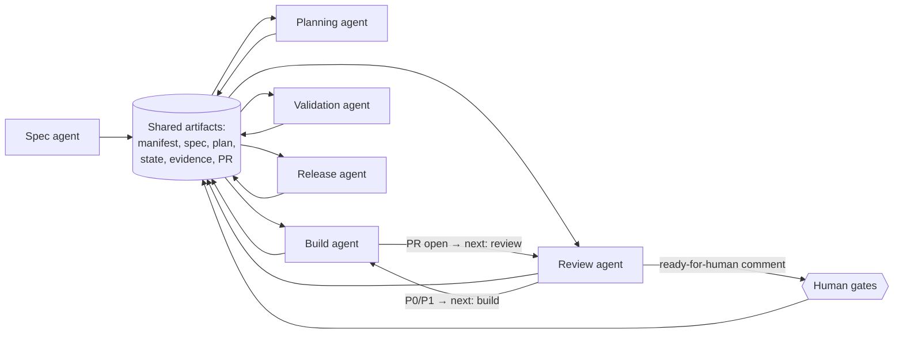

# Agent orchestration

Roles are sequential contracts over shared artifacts, not a hierarchy. There is no coordinator role — the artifacts *are* the coordination, which is what makes a session resumable by a different agent or a human.

After a PR exists, the required handoff is explicit: build sets next action to `review`; review publishes on the PR and either returns next action to `build` for remediation or posts the ready-for-human comment so authorized humans may approve.

Every role reads from and writes to the same artifacts. No role holds state that another role cannot recover from the repository — see the resumption rule in [guide/07-commands.md](../guide/07-commands.md).

Parallel execution is a worktree concern, not an orchestration one: [standards/worktrees.md](../standards/worktrees.md).
