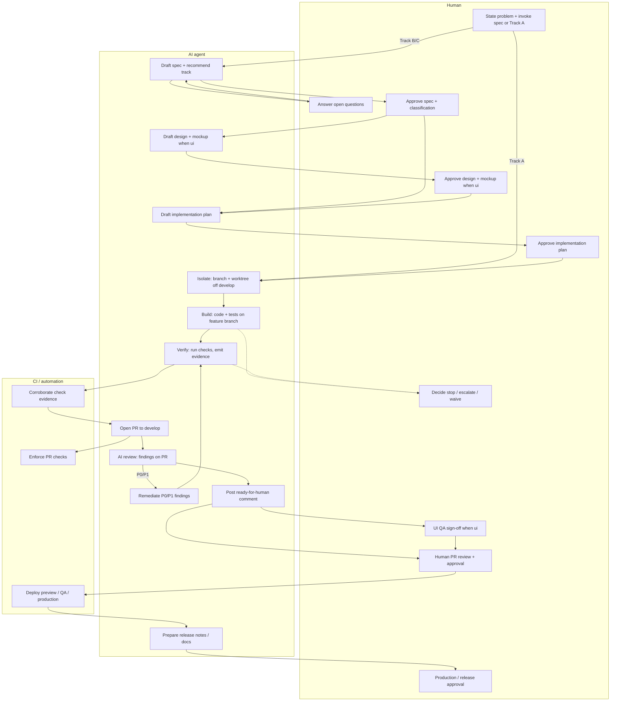

# AI and human activities

Derived from [guide/03-workflow.md](../guide/03-workflow.md) (canonical lifecycle) and [guide/04-roles.md](../guide/04-roles.md). If this diagram and those files disagree, this diagram is wrong.

Swimlanes show **who leads** each activity. CI corroborates evidence and enforces protected-branch rules; it does not replace human approval. Ownership by irreversibility is summarized in [responsibility-matrix.md](responsibility-matrix.md). How a human kicks off the process (with prompt examples): [guide/03-workflow.md](../guide/03-workflow.md) § How a human starts.

## Activity cheat sheet

| Step | AI | Human | CI |
|---|---|---|---|
| **Start (Discover)** | — | State the problem; invoke `spec` or declare Track A | — |
| Spec + classify | Draft, recommend track/tags, ask questions | Answer questions; approve scope and classification | — |
| Design *(ui)* | Draft design + throwaway mockup | Approve design **and** mockup together | — |
| Plan | Draft plan; leave `Approval.decision` pending | Approve plan before any implementation | — |
| Isolate | Create `feat/*`/`fix/*` from `develop` + worktree | — | — |
| Build | Implement and test on the feature branch | — | — |
| Verify | Run safe checks; emit `runner: agent` evidence | Interpret risk; never invent pass/fail | **Corroborate** evidence |
| Preview *(tagged)* | Prepare isolated target | UI QA decision when `ui` | Deploy isolated state |
| AI review | Publish findings; remediate loop; ready-for-human | — | Enforce automated checks |
| Human review | — | Authorize merge; accept or reject findings | Enforce checks |
| Merge / QA | Prepare | Approve PR | Merge policy + deploy QA |
| Release | Prepare notes, tag checklist, docs | Production approval | Deploy; annotated tag on authorized tip |
| Stop / waive | Stop and hand back; **never** waive a gate | Decide next action; waive only with expiry | Expire waivers |

**Hard boundaries:** humans own the kickoff, intent, and irreversible actions (scope, plan, merge, production). Agents draft and implement within those gates. CI alone corroborates evidence — an agent cannot validate its own work.
