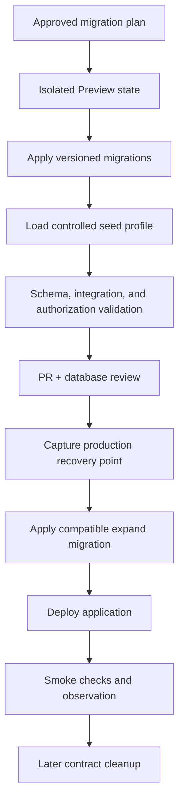

# Database change flow

```mermaid
flowchart TD
    plan[Approved migration plan] --> preview[Isolated Preview state]
    preview --> migratePreview[Apply versioned migrations]
    migratePreview --> seed[Load controlled seed profile]
    seed --> validate[Schema, integration, and authorization validation]
    validate --> review[PR + database review]
    review --> recovery[Capture production recovery point]
    recovery --> expand[Apply compatible expand migration]
    expand --> deploy[Deploy application]
    deploy --> observe[Smoke checks and observation]
    observe --> contract[Later contract cleanup]
```
