# Deployment flow

```mermaid
flowchart LR
    pr[Approved feature/fix PR] --> checks[CI checks emit evidence]
    checks --> develop[Merge to protected develop]
    develop --> qaenv[Continuous QA deployment]
    qaenv --> cut{Release scope complete?}
    cut -->|Yes| relbranch[Cut release/&lt;version&gt;]
    cut -->|No| develop
    relbranch --> relqa[QA hardening + sign-off on release branch]
    relqa --> gate[Production approval]
    gate --> recovery[Capture recovery point]
    recovery --> deploy[Merge release to main, deploy via CI]
    deploy --> smoke[Health + smoke verification]
    smoke -->|Pass| observe[Observation window]
    smoke -->|Fail| rollback[Roll back / forward fix]
    observe --> backmerge[Back-merge main into develop]
    rollback --> record[Deployment record + durable docs]
    backmerge --> record
```

GitFlow by default: `develop` is continuously deployed to the QA environment; a `release/<version>` branch hardens that state before it earns production approval and merges to `main`. A project that opts out of `develop` (see [standards/branching.md](../standards/branching.md#opting-out-of-develop-trunk-based-mode)) collapses this to a single production gate after merge to `main`.

A `hotfix/<issue>-<slug>` branch skips `develop`/`release` entirely: it branches from `main`, goes through the same production-approval and recovery-point steps, deploys, and is back-merged into `develop` immediately after.
