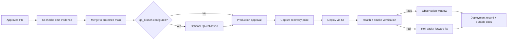

# Deployment flow

Trunk-based by default: there is no staging branch. A project that configures `repository.qa_branch` inserts an optional QA step before the production gate.

```mermaid
flowchart LR
    pr[Approved PR] --> checks[CI checks emit evidence]
    checks --> merge[Merge to protected main]
    merge --> qa{qa_branch configured?}
    qa -->|Yes| qaenv[Optional QA validation]
    qa -->|No| gate[Production approval]
    qaenv --> gate
    gate --> recovery[Capture recovery point]
    recovery --> deploy[Deploy via CI]
    deploy --> smoke[Health + smoke verification]
    smoke -->|Pass| observe[Observation window]
    smoke -->|Fail| rollback[Roll back / forward fix]
    observe --> record[Deployment record + durable docs]
    rollback --> record
```
