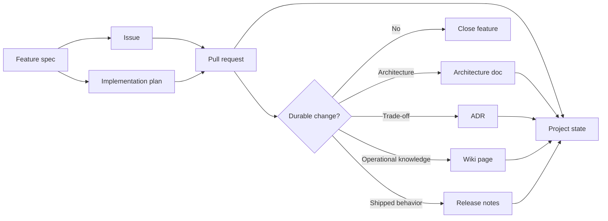

# Document flow

```mermaid
flowchart LR
    spec[Feature spec] --> issue[Issue]
    spec --> plan[Implementation plan]
    issue --> pr[Pull request]
    plan --> pr
    pr --> state[Project state]
    pr --> decision{Durable change?}
    decision -->|No| close[Close feature]
    decision -->|Architecture| architecture[Architecture doc]
    decision -->|Trade-off| adr[ADR]
    decision -->|Operational knowledge| wiki[Wiki page]
    decision -->|Shipped behavior| release[Release notes]
    architecture --> state
    adr --> state
    wiki --> state
    release --> state
```
