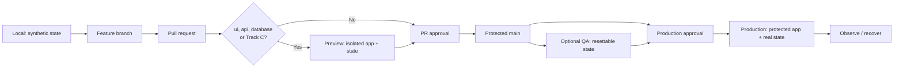

# Environment and promotion flow

Code promotion and data promotion are different actions. An immutable source revision is promoted through the gates; versioned migration artifacts are applied to the target database. A preview database is never promoted into production.
