# Lifecycle

Derived from [guide/03-workflow.md](../guide/03-workflow.md), which is canonical. If this diagram and that file disagree, this diagram is wrong.

```mermaid
flowchart TD
    idea[Idea] --> track{Which track?}

    track -->|Track A| isolate
    track -->|Track B or C| spec[Draft spec on develop]

    spec --> questions{Questions remain?}
    questions -->|Yes| answer[Human answers]
    answer --> spec
    questions -->|No| classify[Classify: track, risk, tags]
    classify --> approval{Human approves scope?}
    approval -->|No| spec
    approval -->|Yes| uitag{ui tag?}
    uitag -->|Yes| design[Design + mockup on develop]
    uitag -->|No| issue[Create / update issue]
    design --> designapprove{Human approves design?}
    designapprove -->|No| design
    designapprove -->|Yes| issue
    issue --> plan[Implementation plan on develop]
    plan --> planapprove{Human approves plan? Track B/C}
    planapprove -->|No| plan
    planapprove -->|Yes| isolate

    isolate[Isolate: create feat/fix from develop + worktree]
    isolate --> build[Build on feature branch: implement + test]

    build --> verify[Verify: emit corroborated evidence]
    verify --> preview{ui, api or database tag?}
    preview -->|Yes| previewenv[Preview env + UI QA]
    preview -->|No| pr[Open PR to develop]
    previewenv --> pr

    pr --> aireview[AI review: publish findings on PR]
    aireview -->|P0/P1 findings| remediate[Build remediates + re-verify]
    remediate --> aireview
    aireview -->|ready for human| humanreview[Human review + approval]
    humanreview --> merge[Merge to develop, deploy QA]
    merge --> relbranch[Release branch: QA hardening]
    relbranch --> relapprove{Production approval}
    relapprove --> release[Merge to main, deploy via CI]
    release --> observe[Observation window]
    observe --> archive[Update durable docs + state]

    build -.->|stop condition| halt[Stop and hand back]
    verify -.->|3 failures| halt
```

**Branch timing:** steps through plan approval happen on `develop` (no feature branch yet). Isolate is the cut. Build and the PR live on `feat/*` / `fix/*`. Hotfixes cut from `main` instead.

The dashed edges are not exceptional paths. Stopping on a repeated failure or an invalidated assumption is a normal, successful outcome — see "Stop conditions" in the workflow.

Who does each step (AI vs human): [ai-human-flow.md](ai-human-flow.md). Worktree layout after Isolate: [worktree-flow.md](worktree-flow.md).
