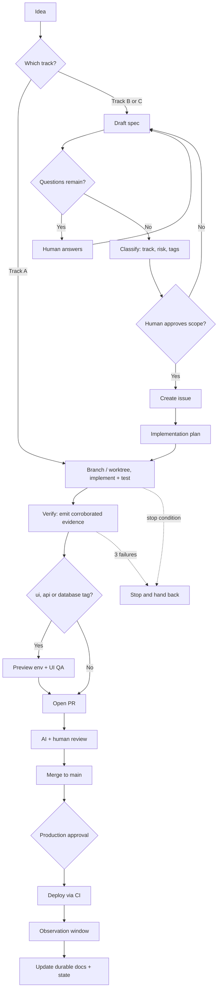

# Lifecycle

Derived from [guide/03-workflow.md](../guide/03-workflow.md), which is canonical. If this diagram and that file disagree, this diagram is wrong.

The dashed edges are not exceptional paths. Stopping on a repeated failure or an invalidated assumption is a normal, successful outcome — see "Stop conditions" in the workflow.
