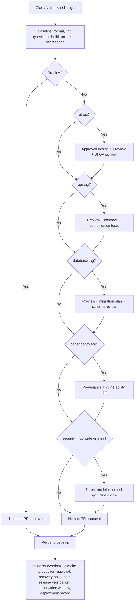

# Quality gates

Derived from [standards/quality-gates.md](../standards/quality-gates.md), which is canonical.

Preview appears inside the tag branches, not in the baseline. It is required for `ui`, `api`, and `database` changes and for all of Track C — not for every pull request.

Release-time gates are separated deliberately: they apply to a deployment, not to a pull request.
