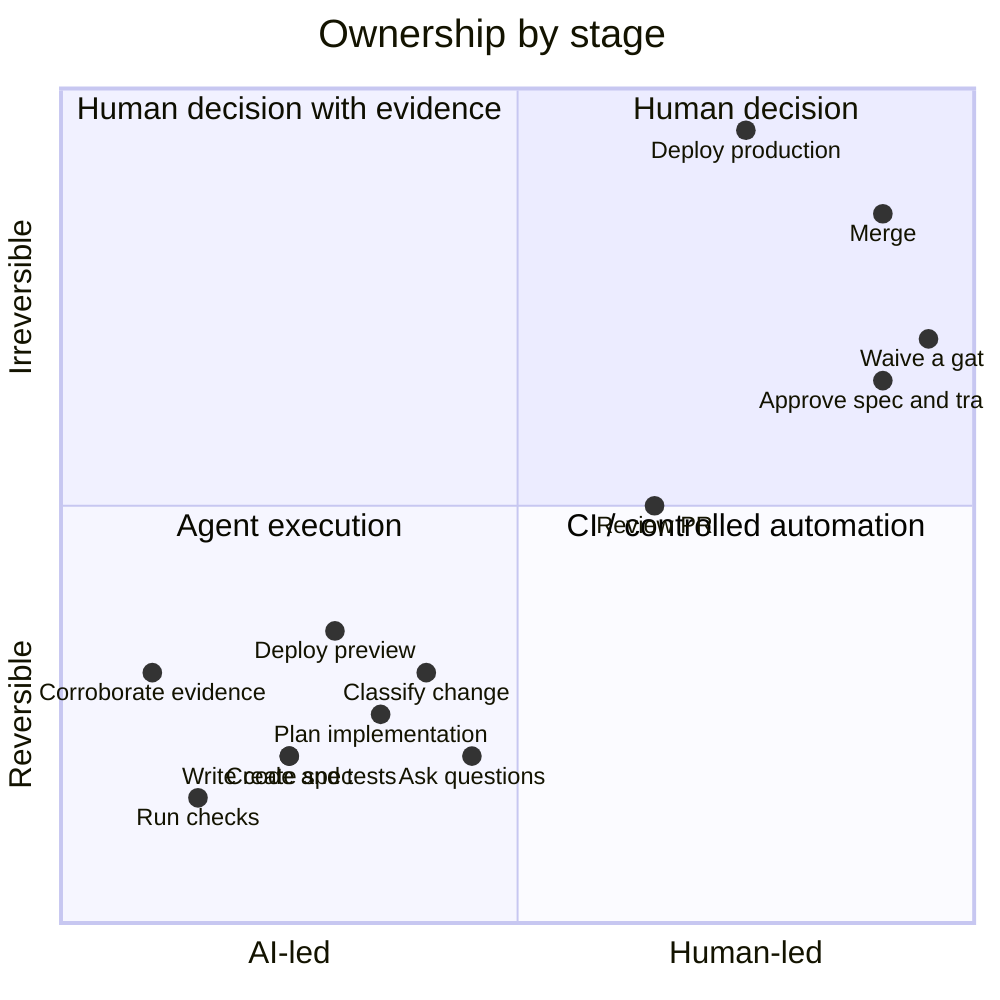

# Responsibility matrix

| Stage | AI | Human | CI |
|---|---|---|---|
| Create spec and classify | Draft, recommend track | Answer, approve track | |
| Plan and build | Lead | Set boundaries | |
| Verification | Run and report | Interpret risk | **Corroborate** |
| Preview | Prepare target | QA decision | Deploy isolated state |
| Review | Analyze | Decide | Enforce checks |
| Waive a gate | Never | Approve with expiry | Expire it |
| Merge | Prepare | Approve | Enforce checks |
| Deploy | Prepare | Approve | Execute |

Two rows carry most of the weight. **Corroboration is CI-only** — an agent cannot validate its own work, which is why the Verification row splits reporting from corroborating. And **waiving a gate is human-only, never AI** — an agent that could waive a gate could satisfy every gate.
