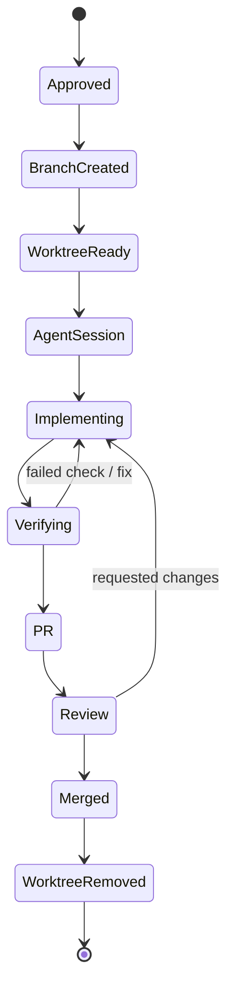

# Worktree flow

```mermaid
stateDiagram-v2
    [*] --> Approved
    Approved --> BranchCreated
    BranchCreated --> WorktreeReady
    WorktreeReady --> AgentSession
    AgentSession --> Implementing
    Implementing --> Verifying
    Verifying --> Implementing: failed check / fix
    Verifying --> PR
    PR --> Review
    Review --> Implementing: requested changes
    Review --> Merged
    Merged --> WorktreeRemoved
    WorktreeRemoved --> [*]
```
