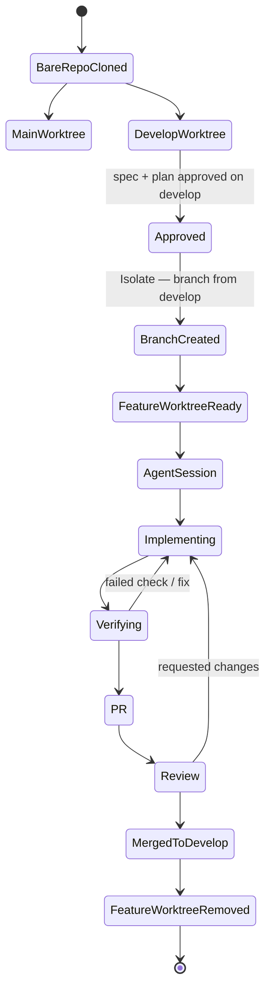

# Worktree flow

Bare-clone layout: one bare repository, plus a persistent worktree for each long-lived branch (`main`, `develop`) and a sibling worktree per short-lived branch. See [standards/worktrees.md](../standards/worktrees.md).

Spec and plan are approved on `develop` before `BranchCreated`. See [guide/03-workflow.md](../guide/03-workflow.md) steps 2, 7, and 9, and [lifecycle.md](lifecycle.md).