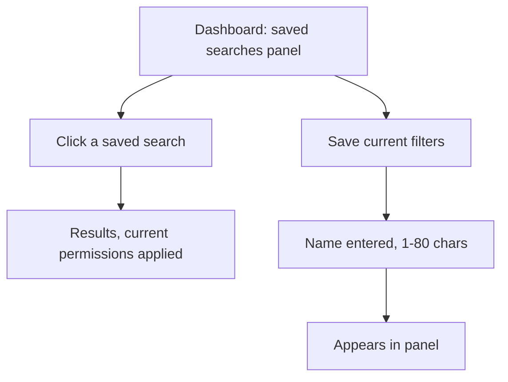

# Design: Saved searches dashboard panel

## User goal

Save the current filters with a name, then find, rerun, rename, or delete a saved search from the search dashboard without leaving it.

## Flow

## States

| State | User sees | Available actions |
|---|---|---|
| Empty | "No saved searches yet" + Save current filters button | Save |
| Loading | Skeleton rows in the panel | Wait |
| Success | List of saved searches, each with rerun/rename/delete | Rerun, rename, delete, save new |
| Validation error | Inline message under the name field | Retry save |
| Unauthorized | Saved search silently excludes now-forbidden records on rerun, no error shown to the owner | Rerun again later |

## Mockup

- Location: `docs/design/mockups/saved-searches/index.html`
- Screens/states covered: empty, loading, success (5 saved searches, realistic name lengths), validation error, delete confirmation.
- Not required, because: n/a — built, since this introduces a new dashboard panel.

The mockup reused the dashboard's existing card and button classes from `src/styles/dashboard.css` so reviewers judged it against the real visual language, not a generic template. It was deleted after plan approval; none of its markup was carried into `src/pages/search.tsx`.

## Accessibility and compatibility

- Keyboard: panel entries are tab-reachable; delete requires a confirmation step, not a bare keypress.
- Screen reader: each saved search announces its name and last-run time.
- Responsive behavior: panel collapses to a single column under 640px.
- Localization: relative "last run" time uses the user's locale.

## Acceptance notes

- [x] Save, rerun, rename, and delete are each reachable from the panel.
- [x] A saved search that has become unauthorized reruns silently narrowed, not with an error.

## Approval

- Decision: `approved`
- Approver: Design/product owner
- Date: 2026-07-21
- Notes: Approved against the mockup, not the flow diagram alone — the pivot between "empty" and "5 saved searches" states changed panel height enough to affect the dashboard's overall scroll behavior, which only became visible once it was clickable.

## Agent instruction

Do not write an implementation plan against this design until `Approval.decision` is `approved`. If review feedback changes the flow, states, or scope, update this document — and the mockup, if one exists — and return it for re-approval before planning.
