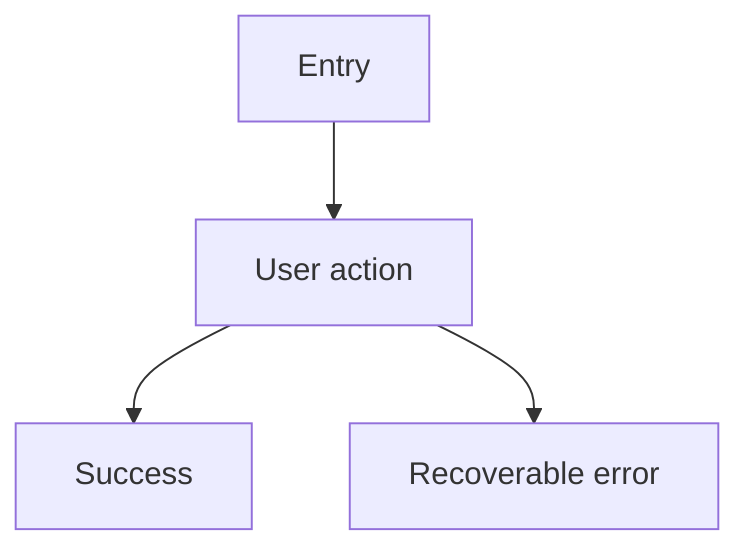

# Design: <experience>

## User goal

<What the user is trying to accomplish.>

## Flow

## States

| State | User sees | Available actions |
|---|---|---|
| Empty | <message> | <action> |
| Loading | <indicator> | <action or wait> |
| Success | <result> | <next actions> |
| Error | <plain-language explanation> | <recovery> |

## Mockup

A static HTML/CSS/JS artifact, built with mock data, that a human can actually click through — not a description of one. Required by default for `ui`-tagged Track B/C changes; see [standards/ui-and-preview.md](../standards/ui-and-preview.md) for what "covers" means and when skipping it is legitimate.

This is **not** the Preview environment. It is throwaway, built before planning, and gates the plan approval below — not the PR.

- Location: `<path or link, e.g. docs/design/mockups/<slug>/index.html>`
- Screens/states covered: <list, or "all states above">
- Not required, because: `<n/a | one-line reason, visible to the approver>`

## Accessibility and compatibility

- Keyboard: <behavior>
- Screen reader: <labels and announcements>
- Responsive behavior: <breakpoints or adaptation>
- Localization: <text, dates, numbers>

## Acceptance notes

- [ ] <observable interaction>

## Approval

- Decision: `pending | approved | rejected`
- Approver: <name or role, human design/product owner>
- Date: YYYY-MM-DD
- Notes: <trade-offs or conditions>

## Agent instruction

Do not mark `Approval.decision` as `approved` while the Mockup section is blank and unexplained — either a location is filled in, or "Not required, because" states a specific, checkable reason. Do not write an implementation plan against this design until `Approval.decision` is `approved`. If review feedback changes the flow, states, or scope, update this document — and the mockup, if one exists — and return it for re-approval before planning.
